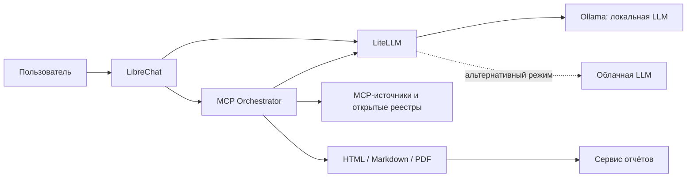

# OSINT MCP UI

Платформа для исследования компаний и их публичной цифровой инфраструктуры.
Пользователь вводит запрос в чат, оркестратор определяет юридическое лицо,
опрашивает подходящие источники и сохраняет досье в **HTML, Markdown и PDF**.

Интерфейс построен на LibreChat, источники подключаются через MCP, модели —
через LiteLLM. Генерацию можно выполнять на собственной видеокарте через Ollama.
**Локальная LLM не делает OSINT автономным от интернета:** реестры, поисковые
системы и сайты компаний по-прежнему запрашиваются по сети.

## Содержание

- [Возможности и ограничения](#возможности-и-ограничения)
- [Архитектура](#архитектура)
- [Сервер для локальной LLM](#сервер-для-локальной-llm)
- [Развёртывание с Ollama и NVIDIA GPU](#развёртывание-с-ollama-и-nvidia-gpu)
- [Первый вход и запрос компании](#первый-вход-и-запрос-компании)
- [Проверка локальной модели](#проверка-локальной-модели)
- [Другие варианты запуска](#другие-варианты-запуска)
- [Источники и API-ключи](#источники-и-api-ключи)
- [Удалённый доступ](#удалённый-доступ)
- [Обновление и резервное копирование](#обновление-и-резервное-копирование)
- [Диагностика](#диагностика)
- [Разработка и тесты](#разработка-и-тесты)

## Возможности и ограничения

| Область | Что собирает система |
|---|---|
| Идентификация | Название юридического лица, юрисдикция, LEI, CIK, ИНН/ОГРН — когда соответствующий реестр доступен |
| Компания | Корпоративная структура, опубликованные сведения о руководстве, деятельность, проекты и география |
| Финансы | Годовые показатели SEC XBRL для американских эмитентов; отчётность российских юридических лиц через Checko |
| Испания | Публикации BORME, исторические назначения и изменения полномочий |
| Инфраструктура | Домены, DNS, WHOIS/RDAP, поддомены, IP/ASN, сертификаты, почтовые политики, публичные индексы сервисов |
| Доказательства | Ссылки на источники, время сбора, цитируемые факты, таблица покрытия и причины отказов |
| Представление | HTML с оглавлением, темой и диаграммами, исходный Markdown и PDF |

Поддерживаются и отдельные запросы по доменам, IP, username, email, URL и хешам
в пределах подключённых инструментов. Используйте систему для законной работы
с открытыми данными.

Отсутствие ответа источника не доказывает отсутствие сведений. Историческое
назначение не подтверждает текущую должность. Отчётность РСБУ отдельного
юридического лица не равна консолидированной отчётности группы.
Модель может ошибаться; существенные выводы требуют проверки по первоисточникам.
Полнота досье зависит от страны, доступности источников, ключей и выбранной LLM.

## Архитектура



Чат видит четыре инструмента оркестратора: `investigate`, `plan`, `catalog`,
`call_server`. Подбор источников, идентификация и сбор таблиц выполняются
серверным кодом. Модель извлекает и обобщает факты; при её отказе возможен
сокращённый детерминированный отчёт, а не полноценный аналитический синтез.

У LLM три места применения: чат, внутренняя маршрутизация и написание досье.
Выбор локального пресета **только в UI** не переключает внутреннего писателя.
Файл `docker-compose.local.yml` переводит обе внутренние роли на `qwen2.5-14b`;
в интерфейсе нужно выбрать **Local · OSINT Авто**.

## Сервер для локальной LLM

Ориентир для одного пользователя и последовательной генерации досье:

| Компонент | Практический вариант |
|---|---|
| GPU | NVIDIA RTX 4090, 24 ГБ VRAM |
| CPU | Современный процессор с 8 ядрами; специальный серверный CPU не обязателен |
| RAM | 32 ГБ для старта, 64 ГБ с запасом для контейнеров и параллельной работы |
| Диск | NVMe SSD от 1 ТБ; перед установкой желательно от 100 ГБ свободного места |
| ОС | Ubuntu 22.04/24.04 LTS x86-64 либо совместимый Linux |
| Охлаждение и питание | Под требования конкретной видеокарты; учитывайте длительную нагрузку |

Это оценка для планирования, а не измеренный бенчмарк. Скорость зависит от
объёма источников, контекста, сетевых задержек и квантования.

В локальном профиле используется **Qwen2.5 14B**. Тег `qwen2.5:14b` в Ollama
содержит квантованную модель размером около 9 ГБ с поддержкой инструментов
и контекстом 32K. Память контекста и служебные буферы расходуются дополнительно
к весам. Подробности: [карточка модели](https://ollama.com/library/qwen2.5:14b).

Для первого запуска оставьте один одновременный запрос к модели. Маленький
`qwen2.5:1.5b`, доступный в базовом Compose-профиле, подходит для проверки
соединений; считать его равноценной заменой сильной модели для досье нельзя.
Качество локальной 14B также нужно проверить на своих компаниях: совпадение
с облачной моделью не гарантируется.

## Развёртывание с Ollama и NVIDIA GPU

Ниже — полный сценарий для Linux. Команды выполняются из корня репозитория
в одной shell-сессии. Они предназначены для нового стенда; существующий `.env`
и тома не нужно перезаписывать.

### 1. Подготовить Docker и GPU

Установите Git, Python 3.10+ с модулем `venv`, Docker Engine и плагин Compose версии 2.24.4 или новее.
Локальный override использует `!reset`, чтобы убрать зависимость от облачного прокси.
Пользователь должен иметь право запускать Docker.

Установите драйвер NVIDIA и
[NVIDIA Container Toolkit](https://docs.nvidia.com/datacenter/cloud-native/container-toolkit/latest/install-guide.html)
по инструкции для вашей ОС. После установки Toolkit настройте Docker runtime:

```bash
nvidia-smi
sudo nvidia-ctk runtime configure --runtime=docker
sudo systemctl restart docker
docker version
docker compose version
```

Перезапуск Docker влияет на уже работающие контейнеры. На действующем сервере
запланируйте его отдельно. Проброс GPU в Ollama соответствует
[официальной инструкции Ollama](https://docs.ollama.com/docker).

### 2. Получить проект и зависимости генератора

```bash
git clone git@github.com:OSINTrepo/MCPUI.git
cd MCPUI
python3 -m venv .venv
source .venv/bin/activate
python -m pip install -r generator/requirements.txt
```

SSH-ключ должен иметь доступ к репозиторию. Для HTTPS используйте адрес
`https://github.com/OSINTrepo/MCPUI.git` и авторизацию GitHub при необходимости.

### 3. Создать `.env` с собственными секретами

Следующий код создаёт новый файл из примера и заполняет внутренние секреты.
Он **откажется перезаписывать существующий `.env`** и не выведет ключи в терминал.

```bash
python - <<'PY'
from pathlib import Path
import os
import secrets

values = {name: secrets.token_hex(32) for name in (
    'CREDS_KEY', 'JWT_SECRET', 'JWT_REFRESH_SECRET', 'MEILI_MASTER_KEY')}
values['CREDS_IV'] = secrets.token_hex(16)
values['LITELLM_MASTER_KEY'] = 'sk-' + secrets.token_hex(24)
lines = Path('.env.example').read_text().splitlines()
for i, line in enumerate(lines):
    name = line.split('=', 1)[0]
    if name in values:
        lines[i] = name + '=' + values[name]
fd = os.open('.env', os.O_WRONLY | os.O_CREAT | os.O_EXCL, 0o600)
with os.fdopen(fd, 'w') as out:
    out.write('\n'.join(lines) + '\n')
print('.env создан. Добавьте нужные ключи источников.')
PY
```

Для локального режима ключи DeepSeek, Alibaba, OpenAI, Anthropic и GigaChat
не нужны. Внутренний `LITELLM_MASTER_KEY` нужен всегда: он защищает шлюз,
это не ключ платного провайдера. Не меняйте `CREDS_KEY`/`CREDS_IV` после
сохранения пользовательских ключей — иначе vault не сможет их расшифровать.

### 4. Сгенерировать конфигурацию и выбрать локальный профиль

```bash
python generator/generate.py
docker build -t osint-mcp-base:latest servers/base

export COMPOSE_FILE=docker-compose.yml:docker-compose.mcp.yml:docker-compose.local.yml:docker-compose.gpu.yml
export COMPOSE_PROFILES=local-llm

docker compose config --quiet
docker compose up -d --build
```

Эти две переменные нужно повторно установить в новой shell-сессии перед
управлением локальным стендом. Все последующие команды `docker compose`
предполагают, что они установлены. Скрипт `scripts/up.sh` запускает базовый
облачный вариант и не подключает эти дополнительные Compose-файлы.

При первом запуске `ollama-init` скачивает модель. Это несколько гигабайт,
поэтому загрузка может занять время. Успешный `ollama-init` завершится с кодом 0:
это одноразовый сервис, ему не нужно постоянно оставаться в состоянии Running.

```bash
docker compose logs -f ollama-init
docker compose ps -a ollama-init
docker compose exec ollama ollama list
```

В списке должна присутствовать `qwen2.5:14b`. При сетевом сбое загрузку можно
повторить: `docker compose run --rm ollama-init`.

### 5. Проверить модель и доступность UI

```bash
docker compose ps
docker compose exec ollama nvidia-smi
docker compose exec -T orchestrator python - qwen2.5-14b < scripts/check_llm.py
```

Проверка делает два коротких запроса: вызов инструмента и JSON. Она не запускает
расследование. После неё команда `docker compose exec ollama ollama ps`
показывает загруженную модель и использование GPU. `ollama list` показывает
скачанные модели, а не факт их исполнения на видеокарте.

| Сервис | Адрес на сервере |
|---|---|
| Интерфейс LibreChat | http://localhost:3080 |
| Список отчётов | http://localhost:8899 |
| LiteLLM API | http://localhost:4000/v1 |
| Ollama внутри Docker | http://ollama:11434 |

Порт Ollama в приведённой конфигурации не публикуется на хост.

## Первый вход и запрос компании

Создайте свою учётную запись через форму регистрации, если она включена,
или штатной командой LibreChat:

```bash
docker compose exec librechat npm run create-user -- analyst@example.org "Аналитик" analyst --email-verified=true
```

Замените email и логин своими. Пароль вводится в приглашении команды;
не передавайте его аргументом shell. Репозиторий не содержит готового
административного пароля. Существующему пользователю нужно войти своей
учётной записью.

1. Откройте UI, войдите и создайте **новый чат**.
2. Выберите **Local · OSINT Авто**. В базовой конфигурации основным остаётся
   DeepSeek, поэтому для локального стенда этот выбор обязателен.
3. Убедитесь, что в строке ввода выбран **OSINT Orchestrator**.
4. Отправьте запрос и дождитесь завершения `investigate`.
5. Откройте HTML из ответа. Полный документ находится в файле, а не в сводке чата.

Примеры запросов:

```text
Собери подробное досье по компании Microsoft Corporation, США,
тикер MSFT, CIK 0000789019, официальный сайт microsoft.com.
Нужны юридическая идентификация, структура и руководство, годовые финансы,
деятельность, проекты, география, инфраструктура домена и источники.
Сохрани HTML, Markdown и PDF.
```

```text
Собери досье по ПАО «Магнит», Россия, ИНН 2309085638, сайт magnit.com.
Разделяй сведения о юридическом лице и о группе компаний.
```

```text
Собери досье по INDRA SISTEMAS SA, Испания, CIF A28599033,
сайт indracompany.com. Укажи источники и ограничения данных.
```

Неизвестные реквизиты можно опустить. Указание страны, официального сайта и
известного идентификатора уменьшает риск смешать одноимённые компании.

## Проверка локальной модели

Локальный профиль согласует все роли:

| Роль | Настройка | Значение |
|---|---|---|
| Чат и вызовы инструментов | Пресет `Local · OSINT Авто` | `qwen2.5-14b` |
| Заголовки чатов | `titleModel` локального endpoint | `qwen2.5-14b` |
| Маршрутизация | `ORCHESTRATOR_MODEL` | `qwen2.5-14b` |
| Аналитическое досье | `ORCHESTRATOR_REPORT_MODEL` | `qwen2.5-14b` |
| Модель в Ollama | `litellm_params.model` | `ollama_chat/qwen2.5:14b` |

Параметры локального профиля: контекст 32 768, один параллельный запрос,
одна загруженная модель. Чат ограничен контекстом 24 000, чтобы оставить место
для ответа. Большие наборы документов всё равно могут превысить окно модели.
Увеличение контекста повышает расход памяти; проверяйте фактическую загрузку
через `ollama ps`. [Контекст Ollama](https://docs.ollama.com/context-length).

После проверки инструментов выполните полный запрос из UI и оцените:

- идентичность компании и её юрисдикцию;
- финансовые периоды, валюты и единицы измерения;
- ссылки, цитаты и даты документов;
- полноту корпоративных сведений;
- список недоступных источников и наличие всех форматов файлов.

Успешный HTTP-ответ и длинный текст сами по себе не подтверждают качество.
На сервере разработки локальная GPU-генерация не измерена; профиль не следует
считать проверенным бенчмарком для RTX 4090. История сетевых проверок описана
в [проверках UI](docs/UI_REPORTS.md) и [аудите стран](docs/COUNTRY_AUDIT.md).

## Другие варианты запуска

### CPU без NVIDIA

Исключите GPU-файл, остальные шаги остаются такими же:

```bash
export COMPOSE_FILE=docker-compose.yml:docker-compose.mcp.yml:docker-compose.local.yml
export COMPOSE_PROFILES=local-llm
docker compose up -d --build
```

14B на CPU работает существенно медленнее и может не уложиться в таймауты.
Для проверки соединений можно отдельно использовать базовую модель 1.5B;
это не проверка качества корпоративных досье.

### Ollama уже установлена на хосте

Не подключайте `docker-compose.local.yml` и `docker-compose.gpu.yml`:
они предназначены для Ollama внутри Docker. Скачайте `qwen2.5:14b` на хосте,
настройте Ollama на доступный из Docker адрес и укажите в `.env`:

```dotenv
OLLAMA_BASE_URL=http://host.docker.internal:11434
ORCHESTRATOR_MODEL=qwen2.5-14b
ORCHESTRATOR_REPORT_MODEL=qwen2.5-14b
```

LiteLLM уже содержит `host-gateway` для этого имени на Linux. Ollama, слушающая
только `127.0.0.1`, недоступна из контейнера: настройте `OLLAMA_HOST` и разрешите
доступ из Docker-сети в firewall, не открывая API в публичный интернет.
Примените изменения к LiteLLM и оркестратору, затем выберите локальный пресет:

```bash
unset COMPOSE_FILE COMPOSE_PROFILES
docker compose -f docker-compose.yml -f docker-compose.mcp.yml up -d --no-deps litellm orchestrator
```

### Другая локальная модель

Нужна instruct/chat-модель с рабочими tool calls, русским языком, JSON и
достаточным контекстом. Для замены синхронно измените:

1. Загрузку модели в `docker-compose.local.yml`.
2. Alias и `ollama_chat/<тег>` в `litellm/config.yaml`.
3. Модель/заголовки локального endpoint и пресета в
   `generator/templates/librechat.yaml.j2`.
4. Обе внутренние модели в локальном Compose-файле.

Запустите генератор и пересоздайте затронутые сервисы. Сначала проверьте новый
alias через `scripts/check_llm.py`, затем — на полноценном досье.
Для интеграции используется [Ollama Chat в LiteLLM](https://docs.litellm.ai/docs/providers/ollama).

### Облачная LLM

Без локального override действуют модели из `.env`; по умолчанию — DeepSeek.
Заполните соответствующий ключ, затем запустите базовый стек:

```bash
unset COMPOSE_FILE COMPOSE_PROFILES
./scripts/up.sh
```

В UI выберите соответствующий пресет. Конфигурация китайских API-провайдеров,
включая разделение Alibaba PAYG и Token Plan: [CHINESE_MODELS.md](docs/CHINESE_MODELS.md).

## Источники и API-ключи

Локальная LLM заменяет расходы на генерацию, но не подписки на источники.
Без ключей часть серверов запускается, однако не возвращает данные.
Платный сервис не становится бесплатным после переноса модели на свою GPU.

Ключи задаются в `.env` и, для поддерживающих это серверов, в настройках MCP
пользователя. Источник истины — [registry/servers.yaml](registry/servers.yaml):
там указаны назначение, тип авторизации, стоимость и признак `enabled`.
Ключи, введённые в UI, не следует автоматически считать доступными всем
внутренним запросам оркестратора: для серверного сборщика используйте `.env`.

Чтобы отключить ненужный сервер, установите `enabled: false` в реестре,
запустите `python generator/generate.py` и примените Compose-конфигурацию.
Уже созданный контейнер отключённого сервера может остаться orphan-контейнером;
его удаление выполняется отдельно после проверки.

## Удалённый доступ

Для личного использования удобен SSH-туннель с **двумя** портами:

```bash
ssh -L 3080:localhost:3080 -L 8899:localhost:8899 USER@SERVER
```

После этого открывайте http://localhost:3080 на своём компьютере. Ссылки на
http://localhost:8899 также будут работать. Без туннеля `localhost` в браузере
указывает на ваш компьютер, а не на удалённый сервер.

Если отчёты доступны через отдельный домен, укажите в `.env`:

```dotenv
REPORTS_URL_BASE=https://reports.example.org
```

Пересоздайте оркестратор: `docker compose up -d --no-deps orchestrator`.
Это меняет ссылки в **новых** отчётах; DNS, HTTPS и reverse proxy настраиваются
отдельно. Для публичного UI также настройте `DOMAIN_CLIENT` и `DOMAIN_SERVER`
на внешний URL LibreChat.

Базовый Compose публикует порты 3080, 4000 и 8899 на интерфейсах хоста.
Сервис отчётов — обычный nginx с каталогом файлов, без авторизации LibreChat.
Для общего доступа закройте прямой доступ firewall и настройте HTTPS и
авторизацию reverse proxy; не публикуйте каталог расследований без ограничения.

## Обновление и резервное копирование

Перед обновлением сохраните `.env`, каталог `reports/`, конфигурацию и дамп MongoDB.
Резервные копии могут содержать чувствительные данные — храните их отдельно от Git.

```bash
mkdir -p backups
chmod 700 backups
umask 077
cp .env backups/env.backup
docker compose exec -T mongodb mongodump --archive --gzip > backups/mongodb.archive.gz
tar -czf backups/reports.tar.gz reports
```

Обновление кода и контейнеров:

```bash
git pull --ff-only
python generator/generate.py
docker build -t osint-mcp-base:latest servers/base
docker compose up -d --build
docker compose ps
```

Изменения файлов, подключённых через bind mount, не всегда перечитываются
работающим процессом. После изменения только конфигурации используйте
`docker compose up -d --no-deps --force-recreate librechat litellm orchestrator`.
Если обновился базовый образ, пересоберите производные MCP-образы.

Восстановление MongoDB из архива на подготовленном стенде:

```bash
docker compose exec -T mongodb mongorestore --archive --gzip < backups/mongodb.archive.gz
```

Команда без `--drop` не удаляет существующие коллекции; для полного восстановления
лучше использовать чистый том. Сохраните прежние ключи шифрования из `.env`.
Модели Ollama находятся в Docker-томе `ollama_data`, пользователи и чаты —
в `mongo_data`, индекс поиска — в `meili_data`.

Остановка: `docker compose down`. Добавление `-v` удаляет тома, включая
учётные записи и скачанные модели. Обычное обновление этого не требует.
Образы `latest`/`main-stable` в проекте не фиксируют версию: для стабильного
эксплуатационного стенда закрепите проверенные теги или digest перед обновлением.

## Диагностика

| Симптом | Что проверить |
|---|---|
| Модель не найдена | `ollama list`; окончание загрузки `ollama-init`; alias в LiteLLM и реальный тег в Ollama |
| Ошибка подключения к Ollama | Активен ли профиль; адрес `http://ollama:11434` внутри сети; доступность хоста при внешней Ollama |
| Нет GPU / очень медленно | `nvidia-smi`, NVIDIA Container Toolkit, GPU override, `ollama ps` после запроса |
| Не хватает VRAM | Один одновременный запрос; меньший контекст/модель; отсутствие других GPU-процессов |
| Модель отвечает без инструмента | Пресет Local, выбранный Orchestrator, результат `scripts/check_llm.py` |
| `Endpoint not found` | Новый чат и актуальный пресет; в имени endpoint не должно быть `/` |
| `401` у LiteLLM | Совпадение внутреннего master key в UI, шлюзе и оркестраторе |
| Отчёт долго не появляется | Журналы оркестратора/модели; таймауты внешних API; скорость локального вывода |
| Ссылки не открываются | Проброс порта 8899 или внешний `REPORTS_URL_BASE`; наличие файлов в `reports/` |
| Мало данных | Раздел ограничений; ключи и баланс источников; неоднозначная идентификация компании |

```bash
docker compose logs --tail=100 librechat
docker compose logs --tail=100 orchestrator
docker compose logs --tail=100 litellm
docker compose logs --tail=100 ollama
```

Полное досье может занимать несколько минут. Таймаут UI-инструмента — 15 минут;
внутренние источники и модель имеют собственные, меньшие лимиты. Это не гарантия
завершения любого запроса за указанное время. Ошибки DNS/HTTPS могут возникать
вне приложения; отключение проверки TLS не является исправлением.

## Разработка и тесты

```text
registry/                  Реестр источников и правила подключения
generator/                Генератор Compose, каталога и UI-конфигурации
config/                    Промпты, nginx и сгенерированный LibreChat YAML
litellm/                   Маршруты моделей
servers/orchestrator/      Идентификация, маршрутизация, синтез, HTML/PDF
servers/directapi/         Реестры, корпоративные страницы, DNS и другие HTTP API
servers/base/              Базовый образ и транспортный патч MCP
tests/                     Регрессии и интеграционные проверки
scripts/                   Запуск и диагностика
docs/                      Эксплуатационные заметки и история аудитов
reports/                   Результаты расследований; не включаются в Git
```

Не редактируйте вручную `config/librechat.yaml`, `docker-compose.mcp.yml` и
`config/catalog.json`: они создаются генератором из реестра и шаблонов.
После изменения реестра или шаблона повторите генерацию.

Быстрая проверка конфигурации:

```bash
python generator/generate.py
python tests/unit_ui_config.py
python tests/unit_local_config.py
docker compose config --quiet
git diff --check
```

Регрессии в контейнере с установленными зависимостями:

```bash
docker compose cp tests/. orchestrator:/app/tests/
docker compose exec -T -e PYTHONPATH=/app orchestrator python /app/tests/unit_country_entity.py
docker compose exec -T -e PYTHONPATH=/app orchestrator python /app/tests/unit_pipeline.py
docker compose exec -T -e PYTHONPATH=/app orchestrator python /app/tests/unit_mcp_client.py
```

`tests/browser_company.cjs` выполняет настоящий вход и генерацию через браузер.
Требует Playwright, Chromium и путь `OSINT_UI_CREDENTIALS` к защищённому JSON с
`email`/`password`. По умолчанию проверяет облачный пресет DeepSeek; он не является
автоматическим тестом локальной модели. Для локального профиля выполните
описанную выше проверку модели и ручной запрос через Local.
Сетевые тесты расходуют квоты источников и, при облачном режиме, баланс LLM.

Дополнительные материалы: [реестр](registry/README.md),
[интерфейс и отчёты](docs/UI_REPORTS.md),
[проверка компаний разных стран](docs/COUNTRY_AUDIT.md),
[диагностика соединений](docs/CONNECTIONS.md).
