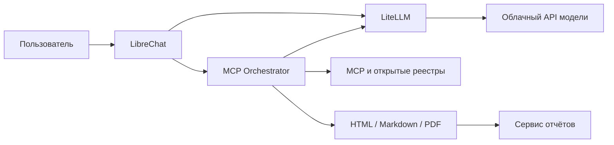

# OSINT MCP UI

Сервис для исследования компаний по открытым источникам. Пользователь вводит
запрос в LibreChat; оркестратор определяет организацию, собирает сведения через
MCP и публичные API и создаёт **HTML, Markdown и PDF** со ссылками на источники.

Основной способ установки ниже использует **облачную модель через API**.
Видеокарта, Ollama, CUDA и скачивание моделей для него не нужны.
Локальная генерация на собственной GPU описана отдельно в
[docs/LOCAL_LLM.md](docs/LOCAL_LLM.md).

**Если вам уже передали готовый `.env` с API-ключами, используйте вариант 3А.**
Не создавайте новый файл поверх него: в нём уже находятся настройки провайдеров.
На отдельном сервере эти ключи используют тот же баланс и квоты поставщиков.

## Что делает система

| Раздел | Данные при наличии подходящих источников |
|---|---|
| Идентификация | Юридическое название, страна, ИНН/ОГРН, LEI, CIK и иные реквизиты |
| Компания | Руководство, структура, деятельность, проекты, опубликованные связи |
| Финансы | Доступная отчётность, периоды, валюты и единицы измерения |
| Реестры | Корпоративные записи, назначения, изменения, судебные сведения |
| Инфраструктура | Домены, DNS, WHOIS/RDAP, IP/ASN, сертификаты и публичные индексы |
| Дополнительные вопросы | Связи с РФ, история работы, партнёры и документы |
| Отчёт | Источники, время проверки, подтверждённые факты и ограничения данных |

Покрытие зависит от юрисдикции, открытости реестров, ключей и тарифов источников.
Недоступный источник не доказывает отсутствие сведений; совпадение имени
не подтверждает личность, а историческая должность — текущую. Существенные
выводы проверяются по первоисточникам.



Чат получает четыре инструмента: `investigate`, `plan`, `catalog`, `call_server`.
Сбор источников и построение таблиц выполняются серверным кодом. Модель помогает
извлекать и обобщать сведения. При отказе модели доступен сокращённый
детерминированный отчёт, но полноценный аналитический синтез требует рабочего API.

## 1. Установить зависимости на сервер

Инструкция рассчитана на свежий **Ubuntu 22.04/24.04 LTS x86-64** с доступом
`sudo` и стабильным интернетом. Для планирования полного стека ориентируйтесь
на 4–8 ядер, 16 ГБ RAM и от 60 ГБ свободного диска; это оценка, не бенчмарк.
Нужен доступ к Docker Registry/GHCR, PyPI, npm и используемым API.

```bash
sudo apt-get update
sudo apt-get install -y git curl ca-certificates openssh-client \
  python3 python3-pip python3-venv nano
```

Установите Docker Engine, Buildx и плагин Compose из
[официального репозитория Docker](https://docs.docker.com/engine/install/ubuntu/).
Если Docker уже установлен и работает, проверьте его версии и не повторяйте
настройку репозитория. Старые конфликтующие пакеты разбираются по инструкции Docker.

```bash
sudo install -m 0755 -d /etc/apt/keyrings
sudo curl -fsSL https://download.docker.com/linux/ubuntu/gpg \
  -o /etc/apt/keyrings/docker.asc
sudo chmod a+r /etc/apt/keyrings/docker.asc
sudo tee /etc/apt/sources.list.d/docker.sources >/dev/null <<EOF
Types: deb
URIs: https://download.docker.com/linux/ubuntu
Suites: $(. /etc/os-release && echo "${UBUNTU_CODENAME:-$VERSION_CODENAME}")
Components: stable
Architectures: $(dpkg --print-architecture)
Signed-By: /etc/apt/keyrings/docker.asc
EOF
sudo apt-get update
sudo apt-get install -y docker-ce docker-ce-cli containerd.io \
  docker-buildx-plugin docker-compose-plugin
sudo systemctl enable --now docker
sudo groupadd --force docker
sudo usermod -aG docker "$USER"
```

Выйдите из SSH-сессии и войдите заново, чтобы применилось членство в группе.
Группа `docker` даёт права управления контейнерами и доступ уровня root;
[порядок настройки доступа](https://docs.docker.com/engine/install/linux-postinstall/).

```bash
docker version
docker compose version
docker run --rm hello-world
```

Используйте плагин `docker compose` версии **2.24.4 или новее**; старый отдельный
`docker-compose` здесь не используется. Дополнительные Compose-файлы содержат
`!reset`; [правила объединения конфигураций](https://docs.docker.com/reference/compose-file/merge/).

Node.js, npm, uv, инструменты OSINT, Python-библиотеки, шрифты и зависимости PDF
устанавливаются в Docker-образы. На хосте вручную ставить их не требуется.
Два MCP-сервиса используют Docker socket для запуска дополнительных контейнеров;
этот вариант рассчитан на обычный Docker Engine на Linux.

## 2. Получить проект и зависимости генератора

```bash
git clone https://github.com/OSINTrepo/MCPUI.git
cd MCPUI
python3 -m venv .venv
source .venv/bin/activate
python -m pip install -r generator/requirements.txt
```

Для закрытого репозитория нужна авторизация GitHub. Если SSH-ключ уже настроен,
можно клонировать `git@github.com:OSINTrepo/MCPUI.git`. Все дальнейшие команды
выполняются из каталога проекта. Скрипты используют `python`, поэтому перед
генерацией конфигурации активируйте `.venv`.

## 3А. Вам передали готовый `.env`

Поместите полученный файл рядом с `docker-compose.yml`. Команда ниже установит
его с доступом только для владельца и не заменит уже существующий файл.
Замените `/path/to/received.env` реальным путём к полученному файлу.

```bash
if [ -e .env ]; then
  printf '%s\n' '.env уже существует: сначала сохраните резервную копию.'
else
  install -m 600 -T /path/to/received.env .env
fi
chmod 600 .env
nano .env
```

**Не выполняйте `cp .env.example .env` или генерацию из раздела 3Б.**
Не запускайте `source .env`: это файл данных для Compose, а не shell-скрипт.
Не выводите ключи через `cat`, `env` или полную команду `docker compose config`.

В редакторе проверьте `ORCHESTRATOR_MODEL`, `ORCHESTRATOR_REPORT_MODEL`
и `REPORTS_URL_BASE`. Ключ и адрес API должны относиться к одному провайдеру,
региону и типу оплаты. Для DeepSeek оставьте обе модели `deepseek-flash`;
для Qwen используйте настройки раздела 4. Полученный `.env` не переносит
пользователей и диалоги: при новой базе нужно создать свою учётную запись.

Для **новой независимой установки до первого запуска** желательно заменить
только внутренние секреты: `CREDS_KEY`, `CREDS_IV`, `JWT_SECRET`,
`JWT_REFRESH_SECRET`, `MEILI_MASTER_KEY`, `LITELLM_MASTER_KEY`. Внешние API-ключи
можно сохранить. Ниже код сохраняет закрытую резервную копию и обновляет
только перечисленные значения, не печатая их.

```bash
python - <<'PY'
from pathlib import Path
from datetime import datetime, timezone
import os, secrets
path = Path('.env')
original = path.read_text()
backup_dir = Path('backups')
backup_dir.mkdir(mode=0o700, exist_ok=True)
backup = backup_dir / ('env-before-new-install-' +
    datetime.now(timezone.utc).strftime('%Y%m%dT%H%M%S%fZ') + '.env')
fd = os.open(backup, os.O_WRONLY | os.O_CREAT | os.O_EXCL, 0o600)
with os.fdopen(fd, 'w') as out:
    out.write(original)
values = {name: secrets.token_hex(32) for name in (
    'CREDS_KEY', 'JWT_SECRET', 'JWT_REFRESH_SECRET', 'MEILI_MASTER_KEY')}
values['CREDS_IV'] = secrets.token_hex(16)
values['LITELLM_MASTER_KEY'] = 'sk-' + secrets.token_hex(24)
lines, found = original.splitlines(), set()
for i, line in enumerate(lines):
    name = line.partition('=')[0].strip()
    if name in values:
        lines[i] = name + '=' + values[name]
        found.add(name)
lines.extend(name + '=' + value for name, value in values.items() if name not in found)
path.write_text('\n'.join(lines) + '\n')
path.chmod(0o600)
print('Внутренние секреты обновлены; API-ключи сохранены.')
PY
```

**Не выполняйте этот код на работающей установке или после восстановления базы.**
Сохранённые пользовательские ключи зашифрованы через `CREDS_KEY`/`CREDS_IV`:
их замена делает vault нечитаемым. При полном восстановлении существующего
стенда сохраните его `.env` вместе с базой и внутренними секретами.

## 3Б. Создать `.env` для новой установки

Этот вариант нужен, если готового `.env` у вас нет. Код создаёт файл из примера,
генерирует внутренние секреты и отказывается перезаписывать существующий файл.

```bash
python - <<'PY'
from pathlib import Path
import os, secrets
values = {name: secrets.token_hex(32) for name in (
    'CREDS_KEY', 'JWT_SECRET', 'JWT_REFRESH_SECRET', 'MEILI_MASTER_KEY')}
values['CREDS_IV'] = secrets.token_hex(16)
values['LITELLM_MASTER_KEY'] = 'sk-' + secrets.token_hex(24)
lines = Path('.env.example').read_text().splitlines()
for i, line in enumerate(lines):
    name = line.partition('=')[0]
    if name in values:
        lines[i] = name + '=' + values[name]
fd = os.open('.env', os.O_WRONLY | os.O_CREAT | os.O_EXCL, 0o600)
with os.fdopen(fd, 'w') as out:
    out.write('\n'.join(lines) + '\n')
print('.env создан; добавьте ключ модели и нужных источников.')
PY
nano .env
```

Внутренний `LITELLM_MASTER_KEY` защищает шлюз; это не ключ платного провайдера.
Храните `.env` и резервные копии вне Git. Пишите значения отдельными строками,
без комментария после значения и без отправки секретов в чат.

## 4. Выбрать облачную модель и источники

Основной настроенный вариант — DeepSeek. Добавьте ключ из
[кабинета провайдера](https://platform.deepseek.com/) или сохраните ключ
из переданного `.env`:

```dotenv
DEEPSEEK_API_KEY=<ключ провайдера>
ORCHESTRATOR_MODEL=deepseek-flash
ORCHESTRATOR_REPORT_MODEL=deepseek-flash
REPORTS_URL_BASE=http://localhost:8899
```

В UI выберите **DeepSeek · OSINT Авто**. Для Alibaba **PAYG** получите ключ в
[Model Studio](https://modelstudio.console.alibabacloud.com/) и настройте:

```dotenv
DASHSCOPE_API_KEY=<ключ Model Studio>
QWEN_API_BASE=https://<workspace-id>.ap-southeast-1.maas.aliyuncs.com/compatible-mode/v1
ORCHESTRATOR_MODEL=qwen-osint-fast
ORCHESTRATOR_REPORT_MODEL=qwen-osint-report
```

Скопируйте адрес OpenAI Compatible Endpoint из своего рабочего пространства.
В UI выберите **Qwen · OSINT Авто**. PAYG и Token Plan имеют разные ключи
и маршруты: не подставляйте плановый ключ вместо `DASHSCOPE_API_KEY`.
Плановый маршрут требует отдельной настройки UI; подробнее
[CHINESE_MODELS.md](docs/CHINESE_MODELS.md). Имена моделей выше — настроенные
alias из `litellm/config.yaml`; доступность конкретного API проверяется отдельно.

**Выбор модели в чате не меняет внутренние модели оркестратора.**
Задайте `ORCHESTRATOR_MODEL` и `ORCHESTRATOR_REPORT_MODEL`. Ключи источников независимы
от ключа модели; их можно добавлять постепенно.

| Источник | Переменные в `.env` | Для чего |
|---|---|---|
| Checko | `CHECKO_API_KEY` | Российские юрлица, ИП и отчётность |
| NewDB | `NEWDB_MCP_TOKEN` | Дополнительные проверки связей с РФ |
| Поиск Serper | `SERPER_API_KEY` | Поиск компаний, людей и документов |
| Google CSE | `GOOGLE_CSE_API_KEY`, `GOOGLE_CSE_DEFAULT_CX` | Альтернативный поиск |
| WhoisXML | `WHOISXML_API_KEY` | WHOIS и история домена; отдельные квоты DRS |
| Whoxy | `WHOXY_API_KEY` | Дополнительная история WHOIS |
| VirusTotal | `VIRUSTOTAL_API_KEY` | Домены, IP и связанные записи |
| Censys | `CENSYS_PAT`, `CENSYS_ORG_ID` | Сервисы, сертификаты, инфраструктура |
| OpenCorporates | `OPENCORPORATES_API_KEY` | Международные корпоративные записи |
| Companies House | `COMPANIES_HOUSE_API_KEY` | Реестр компаний Великобритании |
| Aleph | `ALEPH_API_KEY` | Расширенный доступ к документам |
| Shodan / ZoomEye | `SHODAN_API_KEY`, `ZOOMEYE_API_KEY` | Публичные сетевые индексы |
| Bright Data | `BRIGHTDATA_API_TOKEN` | Дополнительный сбор веб-данных |

Полный список — в [.env.example](.env.example) и
[реестре серверов](registry/servers.yaml). Часть источников работает без ключа,
часть требует отдельный продукт или тариф. Успешный запуск контейнера
не означает, что у API есть баланс. Ключи, введённые только в UI, могут
не быть доступны внутренним серверным запросам; общие ключи задайте в `.env`.

## 5. Проверить настройки и запустить API-версию

Проверка ниже выводит только названия отсутствующих настроек, без значений:

```bash
python - <<'PY'
from pathlib import Path
values = {}
for raw in Path('.env').read_text().splitlines():
    line = raw.strip()
    if not line or line.startswith('#'):
        continue
    name, sep, value = line.partition('=')
    if sep:
        values[name.strip()] = value.strip().strip('"\'')
required = ['CREDS_KEY', 'CREDS_IV', 'JWT_SECRET', 'JWT_REFRESH_SECRET',
            'MEILI_MASTER_KEY', 'LITELLM_MASTER_KEY',
            'ORCHESTRATOR_MODEL', 'ORCHESTRATOR_REPORT_MODEL']
models = [values.get(name, '') for name in required[-2:]]
if any(model.startswith('deepseek-') for model in models):
    required.append('DEEPSEEK_API_KEY')
if any(model.startswith('qwen-osint-') for model in models):
    required.extend(['DASHSCOPE_API_KEY', 'QWEN_API_BASE'])
missing = [name for name in required if not values.get(name) or '<' in values[name]]
if missing:
    raise SystemExit('Заполните настройки: ' + ', '.join(missing))
print('Обязательные настройки присутствуют; доступность API проверяется после запуска.')
PY
export COMPOSE_PROFILES=
export COMPOSE_FILE=docker-compose.yml:docker-compose.mcp.yml:docker-compose.api.yml
python generator/generate.py
docker compose config --quiet
docker build -t osint-mcp-base:latest servers/base
docker compose up -d --build
docker compose ps
```

API-файл применяется последним: GigaChat-прокси отключён, Ollama не запускается
и модели не скачиваются. Первичная сборка скачивает контейнеры и зависимости.
В новой shell-сессии повторно задайте `COMPOSE_FILE` и пустой `COMPOSE_PROFILES`.
Пустое значение в shell также перекрывает профили из переданного `.env`.
Скрипт `scripts/up.sh` использует только базовый и MCP-файлы и **не подключает**
`docker-compose.api.yml`; для этого варианта используйте команды выше.

Проверить модель без расследования и расхода квот OSINT-источников:

```bash
docker compose exec -T orchestrator python - deepseek-flash < scripts/check_llm.py
```

Для Qwen замените alias на `qwen-osint-fast`, затем `qwen-osint-report`.
Проверка делает два коротких запроса к модели и расходует её API-баланс.
Для GigaChat дополнительно задайте его ключ/scope и явно включите профиль
`cloud-gigachat`; подробности переменных находятся в `.env.example`.

## 6. Войти в интерфейс и заказать отчёт

Откройте http://localhost:3080. Зарегистрируйтесь, если форма доступна,
либо создайте пользователя командой LibreChat:

```bash
docker compose exec librechat npm run create-user -- \
  analyst@example.org "Аналитик" analyst --email-verified=true
```

Замените email и логин своими; пароль вводится в приглашении команды.
В новой базе нет учётной записи отправителя `.env` и готового общего пароля.
Создайте новый чат, выберите пресет своего провайдера и **OSINT Orchestrator**.

```text
Собери подробное досье по INDRA SISTEMAS SA, Испания,
CIF A28599033, сайт indracompany.com. Нужны реквизиты, руководство,
финансы, деятельность, контракты и связь с российскими компаниями
и гражданами РФ. Укажи источники, даты и ограничения. Сохрани HTML и PDF.
```

Неизвестные реквизиты можно опустить. После завершения `investigate` откройте
полный HTML из ответа. Файлы сохраняются в `reports/`; список доступен
на http://localhost:8899. Материалы могут быть встроены в HTML для пересылки.

## Удалённый доступ

Для работы со своего компьютера без публичного сервера создайте SSH-туннель
на **оба порта** и оставьте его запущенным:

```bash
ssh -N -L 3080:127.0.0.1:3080 -L 8899:127.0.0.1:8899 user@server
```

Откройте http://localhost:3080 на своём компьютере; `REPORTS_URL_BASE` оставьте
`http://localhost:8899`. Если используете домен и HTTPS, укажите реальный адрес
сервиса отчётов, доступный браузеру, и настройте reverse proxy и авторизацию.
LibreChat не защищает отдельный nginx отчётов: его autoindex показывает все файлы.
Порты опубликованы Compose на хосте; ограничьте доступ правилами сети сервера.

## Изменения, обновление и резервные копии

Перед заменой `.env` сохраните его предыдущую версию в закрытом каталоге
`backups/`. Новый файл установите через `install -m 600`; не печатайте значения.
На действующем стенде сохраните прежние внутренние секреты, включая ключи vault.
Если обновляются только API-ключи, измените соответствующие строки существующего
`.env` через редактор, вместо замены всего файла настройками другого сервера.
Изменения окружения требуют пересоздания контейнеров, одного `restart` недостаточно:

```bash
docker compose config --quiet
docker compose up -d --force-recreate
```

Эта команда применяет ключи также к затронутым MCP-источникам. При точечном
обновлении можно указать `litellm orchestrator librechat` и нужные сервисы источников.
Для обновления кода сначала сохраните собственные изменения, затем:

```bash
source .venv/bin/activate
git pull --ff-only
python -m pip install -r generator/requirements.txt
python generator/generate.py
docker build -t osint-mcp-base:latest servers/base
docker compose up -d --build
```

Сохраняйте `.env`, `reports/`, `data/whois-history-cache/` и архив MongoDB.
Пример резервной копии базы при настроенном API-профиле:

```bash
umask 077
mkdir -p backups
cp .env "backups/env-$(date -u +%Y%m%dT%H%M%SZ).env"
docker compose exec -T mongodb mongodump --archive --gzip \
  > "backups/mongodb-$(date -u +%Y%m%dT%H%M%SZ).archive.gz"
```

Резервные копии содержат секреты и пользовательские данные. Восстановление базы
выполняйте с исходными секретами vault. Обычная остановка `docker compose down`
сохраняет тома; `down -v` удаляет их и не подходит для штатной остановки.

## Диагностика и разработка

| Симптом | Что проверить |
|---|---|
| Нет доступа к Docker socket | Повторный вход после добавления в группу `docker` |
| `python` или модуль `yaml` не найден | Активировать `.venv`, установить `generator/requirements.txt` |
| `!reset` не распознаётся | Обновить Compose и соблюдать порядок трёх файлов |
| Базовый образ не найден | Выполнить сборку `osint-mcp-base:latest` до `compose up --build` |
| Ошибка модели / 401 | API-ключ, alias, адрес, регион и продукт провайдера |
| 402, quota, insufficient balance | Баланс и квоты конкретного API, общие с отправителем ключа |
| В UI другая модель | Пресет чата и обе внутренние модели в `.env` |
| Отчёт не открывается | Порт 8899, SSH-туннель, `REPORTS_URL_BASE` |
| Мало корпоративных сведений | Источники страны, ключи и ограничения доступа к реестрам |
| `ImportError: ... eval_type_backport` | Обновить код и пересобрать сервисы: MCP 1.15 требует закреплённый Pydantic 2.13.5 |
| Контейнер healthy, источник молчит | Проверить MCP initialize/tools/list: `/healthz` проверяет шлюз, а не дочерний Python-процесс |
| Модель пишет «вызываю инструмент» или показывает DSML | Это текст, а не выполненный вызов. Сначала проверить запуск оркестратора, затем открыть новый чат |

Начните с `docker compose ps` и `docker compose logs --tail=100 <сервис>`.
Не публикуйте необработанные журналы или конфигурацию с ключами.
WHOIS-история повторно используется из постоянного кэша; настройка описана
в [DRS_CACHE.md](docs/DRS_CACHE.md).

При ошибке `eval_type_backport` на другом компьютере выполняйте исправление
именно на этом компьютере, из каталога его копии репозитория. Обновление
локальной копии не изменяет другую установку. После сохранения своих изменений:

```bash
source .venv/bin/activate
git pull --ff-only
python generator/generate.py
export COMPOSE_PROFILES=
export COMPOSE_FILE=docker-compose.yml:docker-compose.mcp.yml:docker-compose.api.yml
docker compose build --no-cache orchestrator directapi checko zoomeye openosint
docker compose up -d --no-deps --force-recreate orchestrator directapi checko zoomeye openosint
docker compose restart librechat
docker compose exec -T orchestrator python /app/mcp_startup_smoke.py --url http://127.0.0.1:8000/mcp
```

Последняя команда выполняет `initialize`, `tools/list` и `tools/call` для
`catalog`; она не запускает расследование и не расходует квоты поставщиков.
Успешный результат начинается с `MCP startup OK`. После него откройте новый
чат с пресетом «DeepSeek · OSINT Авто» и отправьте запрос заново. Настоящее
расследование видно в журналах как `tools/call` с именем `investigate`.
Если вместо этого по-прежнему отображается DSML, отдельно проверяйте путь
структурированных вызовов модели; успешный MCP-тест его не подтверждает.
Для установки с локальной моделью используйте свои действующие Compose-файлы
и профиль вместо двух строк `export` для API-режима.

Реестр `registry/servers.yaml` и шаблоны генератора являются источниками
конфигурации. Не редактируйте вручную `config/librechat.yaml`,
`config/catalog.json` и `docker-compose.mcp.yml`: запускайте генератор.
Офлайн-проверки конфигурации: `python tests/unit_ui_config.py`
и `python tests/unit_local_config.py`. Сетевые сценарии расходуют квоты API.

Подробные инструкции: [локальная модель](docs/LOCAL_LLM.md),
[реестр MCP](registry/README.md), [корпоративный поиск](docs/CORPORATE_RESEARCH.md),
[Финляндия](docs/FINLAND_ORGANIZATIONS.md), [Узбекистан](docs/UZBEKISTAN.md),
[связи с РФ](docs/RUSSIA_CONNECTIONS.md), [интерфейс](docs/UI_REPORTS.md).
