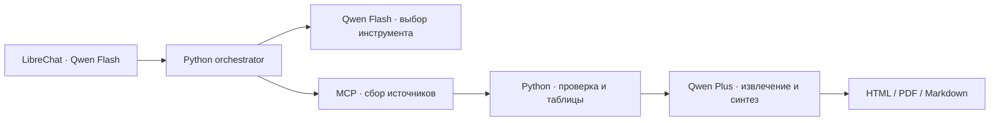

# Китайские модели для OSINT

Проверено 10 сентября 2026. Рекомендация: Qwen3.7-Flash для чата и маршрутизации,
Qwen3.7-Plus для извлечения фактов и написания досье. Это выбор по требованиям
кода, возможностям API и цене; реальный прогон INDRA выполнен. По этому примеру рекомендуем DeepSeek Flash
как основного писателя: 37,9 с против 84,3 с у Qwen Plus.
[Результаты и ограничения](../reports/indra-comparison/model-comparison.md).

## Модели и стоимость

USD за миллион токенов, обычные синхронные запросы, без скидок за кэш/акции:

| Назначение | Модель / API ID | Вход | Выход |
|---|---|---:|---:|
| Чат, выбор инструмента, короткий JSON | `qwen3.7-flash-2026-07-15` | $0.030 до 32K входных токенов; $0.100 до 256K | $0.130 / $0.400 соответственно |
| Извлечение из источников, комментарии, русский текст отчёта | `qwen3.7-plus-2026-05-26` | $0.400 до 256K | $1.600 |

Цены для **International / Singapore**; превышение порога меняет тариф всего
запроса. Для запросов свыше 256K действуют более высокие тарифы. Снимки моделей
зафиксированы, чтобы обновление плавающего имени не меняло поведение незаметно.
[Официальные тарифы Alibaba](https://www.alibabacloud.com/help/en/model-studio/model-pricing).

Иллюстрация, не замер INDRA: суммарно 20K входа и 2K выхода через Flash
(каждый запрос до 32K), плюс 100K входа и 12K выхода через Plus
(каждый запрос до 256K) стоят примерно **$0.060 за досье**, или **$60 за 1000**.
Сюда не входят платные OSINT-источники, повторные генерации и налоги.

Обе модели имеют контекст 1M, поддерживают вызовы функций, структурированный
вывод в non-thinking режиме и изображения. Для данного пайплайна главное —
текст и tool calls; обработка изображений пригодится отдельно для документов.
Это не означает, что текущий текстовый сборщик автоматически извлекает все
сканы PDF. [Возможности моделей](https://www.alibabacloud.com/help/en/model-studio/vision-model).

## Почему эта пара подходит к коду

- LibreChat вызывает только четыре инструмента оркестратора. Для запуска
  `investigate` и показа ссылки на результат достаточно экономичной chat-модели.
- `ORCHESTRATOR_MODEL` выбирает инструменты и помогает с короткими запросами.
  Большая часть маршрутизации уже детерминирована.
- `ORCHESTRATOR_REPORT_MODEL` извлекает цитируемые сведения и пишет комментарии
  и резюме. Здесь полезнее Plus. Числа, таблицы, BORME и графы по-прежнему
  обрабатываются Python; замена LLM не исправляет недоступный DNS или источник.
- `llm()` отправляет `temperature=0.2`, ограничивает ответ вплоть до 120–300
  токенов на коротких задачах и читает только `message.content`.
  Поэтому в подготовленных маршрутах thinking явно выключен. Рассуждение
  по умолчанию увеличивает задержку и расход выходных токенов.
  [Настройки thinking](https://www.alibabacloud.com/help/en/model-studio/deep-thinking).



## Интеграция

Используем существующий LiteLLM и прямой OpenAI-совместимый API Model Studio:
один аккаунт и один ключ для обеих моделей. Дополнительный агрегатор не нужен
для этой пары. Если регистрация или оплата Alibaba недоступна, можно заменить
маршруты на агрегатор после проверки наличия конкретных моделей, цены и
параметров API. Два Qwen-маршрута сами по себе не защищают от отказа Alibaba.

В `litellm/config.yaml` подготовлены:

| Локальное имя | Провайдер |
|---|---|
| `qwen-osint-fast` | Qwen3.7-Flash, thinking выключен |
| `qwen-osint-report` | Qwen3.7-Plus, thinking выключен |
| `deepseek-flash` | Прямой DeepSeek, thinking выключен; дополнительный вариант |

Через шаблон генератора добавлены отдельный endpoint Qwen и пресет
«Qwen · OSINT Авто». Генератор уже запущен. Провайдер и действующие значения
`.env` не переключены; службы не перезапускались ради неподготовленных ключей.

Для активации заполнить **локальную `.env`**, не отправляя ключ в чат:

```dotenv
DASHSCOPE_API_KEY=<ключ из Model Studio>
QWEN_API_BASE=https://<workspace-id>.ap-southeast-1.maas.aliyuncs.com/compatible-mode/v1
ORCHESTRATOR_MODEL=qwen-osint-fast
ORCHESTRATOR_REPORT_MODEL=qwen-osint-report
```

Ключ должен быть из того же региона, что URL. Указан Singapore; рабочий URL
скопировать из кабинета. При пустом URL Compose подставляет прежний Singapore
endpoint Alibaba, чтобы ключ этого провайдера не ушёл на стандартный endpoint
OpenAI. Для нового подключения предпочтителен адрес рабочего пространства.
[Региональные endpoints и ключи](https://www.alibabacloud.com/help/en/model-studio/compatibility-of-openai-with-dashscope).

```bash
python3 generator/generate.py
docker compose -f docker-compose.yml -f docker-compose.mcp.yml up -d \
  --no-deps --force-recreate litellm orchestrator librechat
```

В новом чате выбрать «Qwen · OSINT Авто». **Выбор модели в LibreChat не меняет
внутренние модели оркестратора**: нужны обе переменные выше. Заголовки чатов
Qwen тоже создаёт Flash, поэтому этот endpoint не требует ключа OpenAI.

## Альтернативы и резервирование

**DeepSeek V4.1 Flash** (`deepseek-flash`) — подходящий кандидат для независимого
провайдера и сравнения писателей. Текущие прямые тарифы: $0.30/$1.20 вход/выход
в пиковые часы, $0.15/$0.60 вне пика. Не закладываем новую интеграцию на старые
`deepseek-chat` / `deepseek-reasoner`. По текущему уведомлению, V4 Pro начнут
перенаправлять на V4.1 Flash с 14 сентября 2026; две такие модели не дадут
независимого резерва. [Актуальные модели и тарифы DeepSeek](https://api-docs.deepseek.com/quick_start/pricing/).

**GLM-5.3-Flash** — ещё один экономичный кандидат ($0.15/$0.50), но для текущих
коротких запросов выбранный Flash дешевле. Бесплатные GLM можно использовать
для экспериментов; на них не стоит основывать обещание доступности всего
пайплайна. [Тарифы Z.AI](https://docs.z.ai/guides/overview/pricing).

После настройки DeepSeek и проверки качества можно добавить обычный fallback
LiteLLM `qwen-osint-report → deepseek-flash` и `qwen-osint-fast → deepseek-flash`
для технических отказов. Пока он не включён: отсутствующий ключ лишь добавил
бы таймауты. Сначала один повтор, затем резерв; не вызывать обе модели на
каждой задаче. [Механизм fallback](https://docs.litellm.ai/docs/proxy/reliability).

## Что проверено и что осталось

`tests/unit_llm_gateway.py` проверяет реальный установленный LiteLLM 1.92.0
через локальную заглушку: маршруты моделей, JSON/content, tool calls, передачу
`max_tokens` и отключение thinking. Это проверка транспорта, не качества моделей.
Внешние платные API в тесте не вызываются.

После заполнения ключа повторить сборку сохранённых ответов INDRA:

```bash
docker cp tests/. osint_proj-orchestrator-1:/app/tests
docker exec -e PYTHONPATH=/app osint_proj-orchestrator-1 \
  python -u /app/tests/indra_pipeline.py qwen-indra \
  --replay /reports/indra-comparison/verified/evidence.json
python3 tests/compare_indra.py --final qwen-indra
```

Так сравниваются одинаковые источники без повторной оплаты OSINT-сбора.
Сохранённый резервный импорт официальных страниц остаётся явно обозначенным.
Проверить также настоящий tool call `investigate` из UI, русский текст,
5 457 000 000 EUR, CIF/LEI, даты назначений, точные цитаты и отсутствие выдуманных
лиц при пустом ответе реестра. Наличие 24 разделов само по себе не подтверждает
качество писателя. Нельзя обещать выполнение всех требований без этого прогона.

Записывать фактические usage и задержки; до калибровки ориентироваться на счёт
провайдера. Локальная карта цен LiteLLM не знает все новые снимки: её нулевая
оценка для неизвестной модели **не означает бесплатный вызов**.


## Фактический прогон 10 сентября 2026

Ключи сохранены локально; секретов в документации нет. DeepSeek direct работает.
Alibaba PAYG возвращает AccessDenied.Unpurchased; отдельно проверен переданный
пользователем Token Plan, маршрут `qwen-plan-report` (qwen3.7-plus). Flash на
плановом endpoint недоступен (404). Тестовый маршрут не назначен основным и не
включён в fallback. Для постоянного backend необходим Qwen PAYG либо DeepSeek direct.
Предыдущие разделы с отсутствующими ключами описывают состояние до этого прогона.
Полная оценка: [INDRA / сравнение моделей](../reports/indra-comparison/model-comparison.md).
